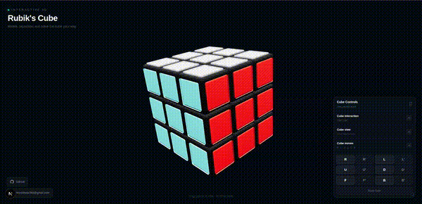
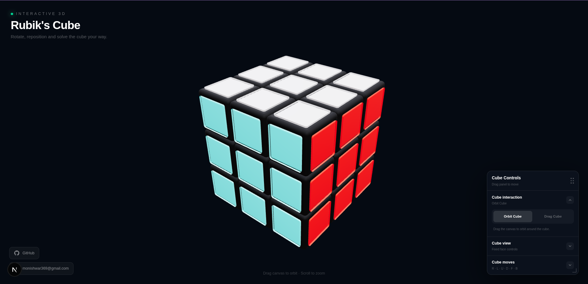
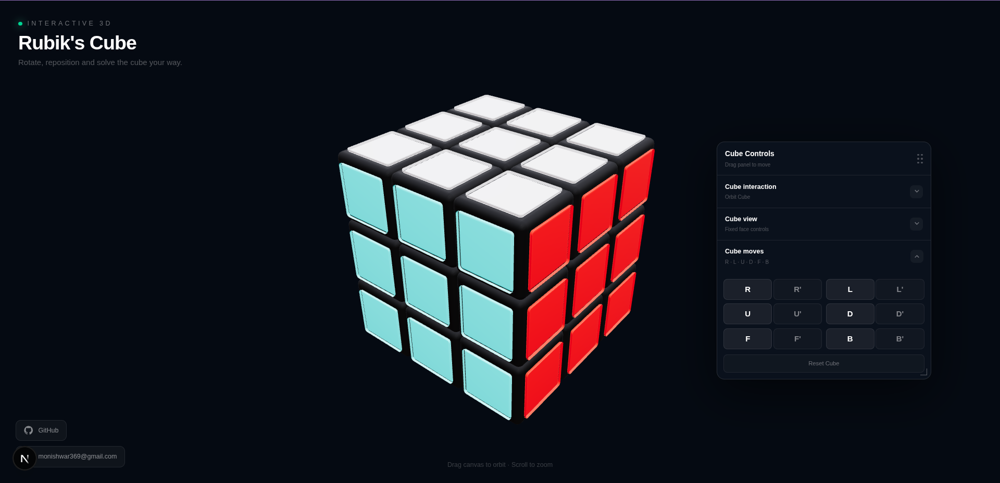

# Rubik's Cube — Interactive 3D

An interactive 3D Rubik's Cube built with **Next.js**, **React Three Fiber**, and **Three.js**.

The application lets you interact with a 3D Rubik's Cube directly in the browser, rotate the camera around the cube, move the cube's position using a dedicated move tool, and perform standard cube face moves.

### Interactive Cube

<p align="center">
  
</p>





## Features

* 🧊 Interactive 3D Rubik's Cube
* 🖱️ Orbit the camera around the cube
* ✋ Move the cube using the Move Tool
* 🔄 Camera remains centered on the cube while moving it
* 🔍 Zoom in and out
* 🎛️ Fixed and camera-relative cube move modes
* 🔤 Standard Rubik's Cube moves:

  * `R`
  * `L`
  * `U`
  * `D`
  * `F`
  * `B`
* ↩️ Counter-clockwise moves:

  * `R'`
  * `L'`
  * `U'`
  * `D'`
  * `F'`
  * `B'`
* ♻️ Reset the cube
* 📱 Responsive layout for desktop and mobile
* 🖼️ 3D rendering using WebGL
* 🎨 Dark glassmorphism-style interface
* 🖱️ Draggable and resizable Cube Moves panel

---

## Tech Stack

* **Next.js**
* **React**
* **TypeScript**
* **React Three Fiber**
* **Three.js**
* **@react-three/drei**
* **Tailwind CSS**

---

## Project Structure

```text
Rubik-s-cube/
├── app/
│   ├── components/
│   │   └── Rubiks.tsx
│   │
│   ├── page.tsx
│   ├── layout.tsx
│   └── globals.css
│
├── public/
│
├── package.json
├── tsconfig.json
├── next.config.ts
└── README.md
```

> The exact structure may vary depending on the current Next.js project configuration.

---

## Getting Started

### 1. Clone the repository

```bash
git clone <your-repository-url>
cd Rubik-s-cube
```

### 2. Install dependencies

Using npm:

```bash
npm install
```

Or:

```bash
yarn install
```

```bash
pnpm install
```

```bash
bun install
```

### 3. Start the development server

```bash
npm run dev
```

Or:

```bash
yarn dev
```

```bash
pnpm dev
```

```bash
bun dev
```

Open:

```text
http://localhost:3000
```

in your browser.

---

# Cube Interaction

## Orbit Mode

In **Orbit** mode, dragging the canvas rotates the camera around the cube.

The cube remains at its current world position while the camera changes its orbit angle.

```text
Drag → Orbit camera
```

The camera always uses the cube's current position as its orbit center.

---

## Move Tool

The **Move Tool** allows the cube to be repositioned on the screen.

The movement is based on the pointer's screen-space movement:

```text
Drag right  → Cube moves right
Drag left   → Cube moves left
Drag up     → Cube moves up
Drag down   → Cube moves down
```

The cube and camera are translated together so that moving the cube does not destroy the camera's orbit relationship.

Conceptually:

```text
Cube position
      ↑
      │
Camera position
      │
      └── constant orbit offset
```

After moving the cube:

```text
Camera position = Cube position + Orbit offset
```

Therefore, orbiting continues around the cube's new center.

---

# Cube View

The application supports two cube-move interpretation modes.

## Fixed

In **Fixed** mode, the move buttons always refer to the physical cube faces.

For example:

```text
R → physical Right face
L → physical Left face
U → physical Up face
D → physical Down face
F → physical Front face
B → physical Back face
```

The camera orientation does not change what the buttons mean.

---

## Cube View

In **Cube View** mode, the move buttons are interpreted relative to the current camera view.

For example, the face currently appearing on the camera's right side becomes the logical `R` face.

The application determines the current mapping from the camera orientation.

```text
Camera
   │
   ├── Right
   ├── Left
   ├── Up
   ├── Down
   ├── Front
   └── Back
```

This allows the controls to remain intuitive even after rotating the cube view.

---

# Cube Moves

The Cube Moves panel provides the standard face rotations.

| Button | Action                  |
| ------ | ----------------------- |
| `R`    | Right clockwise         |
| `R'`   | Right counter-clockwise |
| `L`    | Left clockwise          |
| `L'`   | Left counter-clockwise  |
| `U`    | Up clockwise            |
| `U'`   | Up counter-clockwise    |
| `D`    | Down clockwise          |
| `D'`   | Down counter-clockwise  |
| `F`    | Front clockwise         |
| `F'`   | Front counter-clockwise |
| `B`    | Back clockwise          |
| `B'`   | Back counter-clockwise  |

The actual cube rotation logic is handled by the `Rubiks` component.

---

# Reset

The **Reset Cube** button restores the cube to its solved/default state.

```text
Reset Cube
```

This is exposed through the `RubiksHandle` interface.

---

# Camera System

The camera system uses an orbit representation consisting of:

```text
theta
phi
radius
```

### Theta

Controls horizontal rotation around the cube.

### Phi

Controls vertical rotation around the cube.

### Radius

Controls the camera distance from the cube.

The camera position is calculated from the cube position and these orbit parameters.

Conceptually:

```text
camera =
    cube position
    +
    spherical orbit offset
```

This ensures that the cube remains the center of the camera's orbit even when the cube has been repositioned.

---

# Responsive Cube

The cube automatically scales according to the available viewport size.

The application uses different scale factors for smaller screens:

```text
Viewport < 360px  → 0.55
Viewport < 480px  → 0.65
Viewport < 640px  → 0.75
Viewport < 900px  → 0.90
Otherwise         → 1.00
```

This keeps the cube usable across desktop and mobile screens.

---

# Control Panel

The **Cube Moves** panel is independent from the camera controls.

The panel can be:

* Dragged around the screen
* Resized
* Expanded/collapsed

The panel contains only cube-move controls.

Camera interaction and cube-view controls are kept separate from this panel.

---

# Rendering

The application uses:

```text
React
   ↓
React Three Fiber
   ↓
Three.js
   ↓
WebGL
```

The scene includes:

* Ambient lighting
* Directional lighting
* Environment lighting
* Perspective camera
* 3D Rubik's Cube
* Responsive scaling

---

# Development

The main application logic is located in:

```text
app/page.tsx
```

The Rubik's Cube implementation is located in:

```text
app/components/Rubiks.tsx
```

When developing the project, changes to the Next.js application are automatically reflected by the development server.

---

# Build for Production

Create a production build:

```bash
npm run build
```

Start the production server:

```bash
npm start
```

---

# Deployment

This project can be deployed as a standard Next.js application.

For example, it can be deployed using Vercel.

The production build should be tested locally before deployment:

```bash
npm run build
npm start
```

---

# Future Improvements

Possible future features include:

* Keyboard controls
* Scramble generator
* Move history
* Undo / redo
* Automatic cube solver
* Timer
* Speedcubing mode
* Algorithm notation display
* Cube state serialization
* Random scramble generation
* Touch gestures
* Animation speed controls
* Solve animation
* 3D cube state import/export

---

## License

Add your preferred license here.

For example:

```text
MIT License
```

---

## Author

**Monishwar**

Portfolio:

```text
https://monishwar-m-c.vercel.app
```
